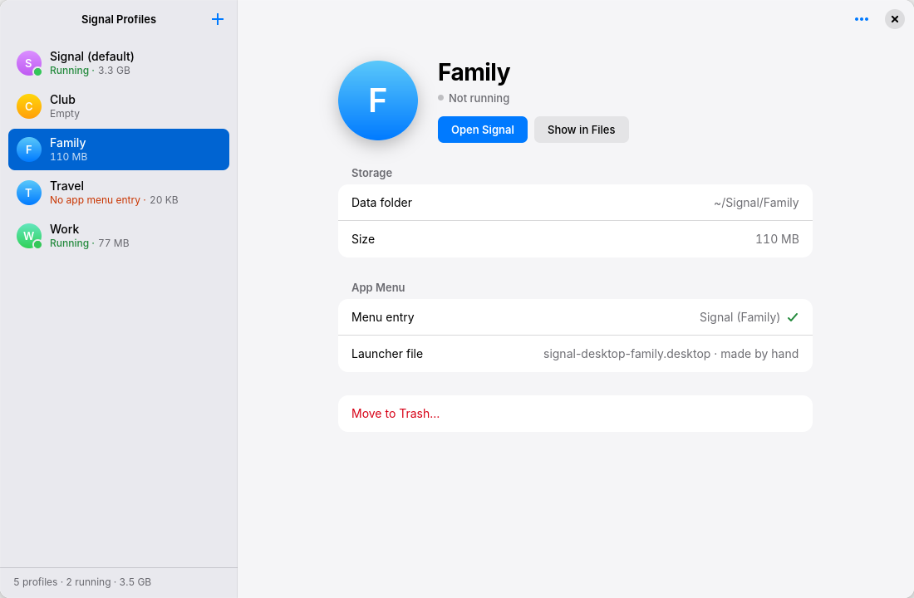
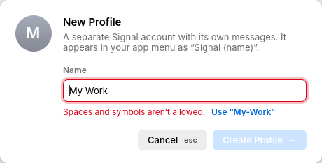
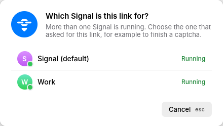
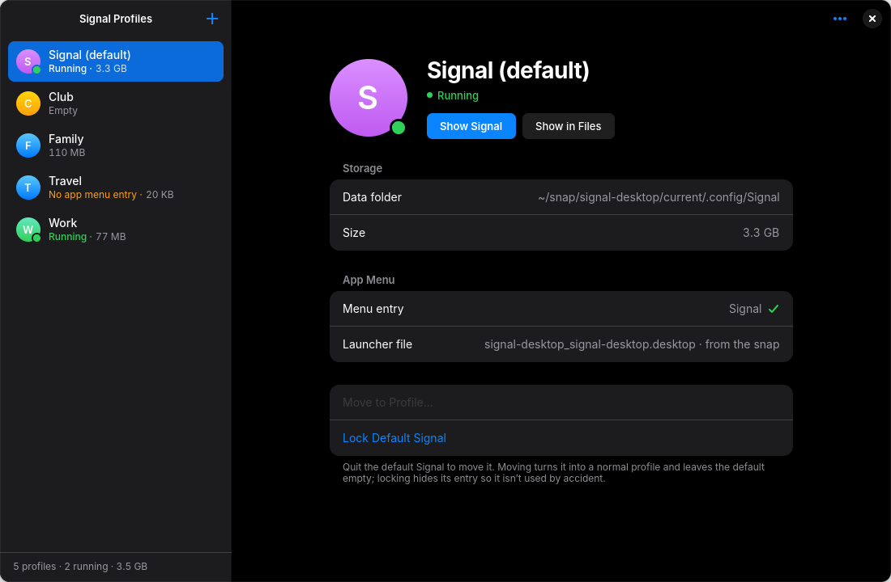
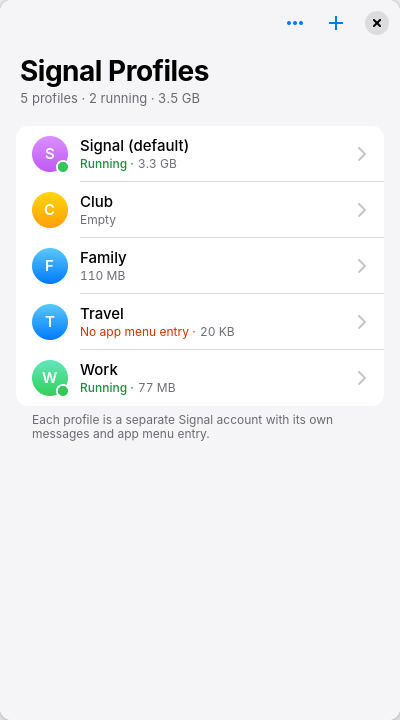
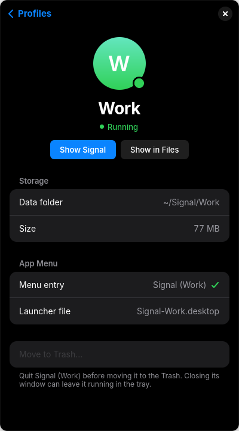

<div align="center">

# MultiSignal

**Run several Signal Desktop accounts side by side on Ubuntu.**<br>
Each profile has its own messages, its own window and its own entry in the app menu.

[](https://github.com/AngelFreak/MultiSignal/releases)
[](https://github.com/AngelFreak/MultiSignal/actions/workflows/release.yml)


<picture>
  <source media="(prefers-color-scheme: dark)" srcset=".github/screenshots/desktop-dark.png">
  
</picture>

</div>

MultiSignal comes in two parts that share the same files, so you can use either
or both:

- **Signal Profiles**, a native GNOME app (GTK 4 + libadwaita) with an
  Apple-style look in light and dark.
- **`multisignal.sh`**, a small command-line tool for the terminal.

## Features

- **Profiles in one window.** Create, open and move profiles to the Trash. You
  can restore them from Files.
- **Live status.** See which profiles are running and how much space each one
  uses.
- **Your default Signal.** The Signal you open from the normal **Signal** menu
  entry is shown too. You can move it into a profile, and lock it so it isn't
  opened by accident.
- **Captcha and re-link links go to the right profile.** `signalcaptcha://` and
  `sgnl://` links are sent to the running Signal that asked for them. If
  several are running, the app asks which one.
- **App menu entries.** Missing or outdated entries are repaired. Hand-made ones
  are left alone.
- **Installs Signal for you** if the Signal Desktop snap is missing.
- **Light, dark or automatic appearance**, from the **⋯** menu.

<table>
  <tr>
    <td width="50%"></td>
    <td width="50%"></td>
  </tr>
  <tr>
    <td align="center"><sub>Create a profile. Invalid names get a one-click fix.</sub></td>
    <td align="center"><sub>Links go to the profile that asked for them.</sub></td>
  </tr>
  <tr>
    <td width="50%"></td>
    <td width="50%" align="center"> </td>
  </tr>
  <tr>
    <td align="center"><sub>Move or lock the default Signal.</sub></td>
    <td align="center"><sub>Narrow windows fold into a list and a detail page.</sub></td>
  </tr>
</table>

## Install

You need Ubuntu 24.04 or newer. You also need the Signal Desktop snap, but the
app offers to install it.

1. Download `multisignal_<version>_amd64.deb` from
   [Releases](https://github.com/AngelFreak/MultiSignal/releases).
2. Install it:

   ```sh
   sudo apt install ./multisignal_*_amd64.deb
   ```

   If the file is in your home folder, apt prints a note that the download is
   "performed unsandboxed as root". That's harmless.
3. Open **Signal Profiles** from the app launcher.

To remove it, run `sudo apt remove multisignal`. Your profiles are not touched.

## Command line

`multisignal.sh` works without the app and without any dialogs:

```console
$ ./multisignal.sh list
NAME                     STATUS      SIZE  APP MENU ENTRY
Family                   -           110M  Signal-Family.desktop
Work                     running      77M  Signal-Work.desktop

$ ./multisignal.sh create Travel
Created “Travel”. Open it from your app menu as “Signal (Travel)” or with: multisignal.sh open Travel
```

| Command | What it does |
|---|---|
| `list` | Shows each profile: running or not, size, and its app menu entry |
| `create NAME` | Creates a profile and its app menu entry |
| `open NAME [LINK]` | Starts Signal for a profile, optionally with a `sgnl://` or `signalcaptcha://` link |
| `delete [--yes] NAME` | Moves a profile and its menu entry to the Trash. It refuses while that Signal is running |
| `repair` | Rewrites this tool's menu entries and adds missing ones |

## How it works

Every profile is a separate Signal Desktop data folder, started with
`--user-data-dir`:

| What | Where |
|---|---|
| Profile data | `~/Signal/<name>/` |
| App menu entry | `~/.local/share/applications/Signal-<name>.desktop` |
| Default Signal (the snap's own) | `~/snap/signal-desktop/current/.config/Signal` |
| App settings | `~/.config/multisignal/settings.ini` |

- **Profile names** use letters, digits, `.`, `_` and `-`, and start with a
  letter or digit.
- **Links** are sent to Signal Profiles, which is the handler for
  `x-scheme-handler/sgnl` and `x-scheme-handler/signalcaptcha`. It becomes the
  handler the first time it runs; turn this off with **⋯ → Handle Signal
  Links**. The profile menu entries don't claim these links themselves. If
  they did, whichever entry was written last would get every captcha.
- **Locking the default Signal** writes a per-user copy of the snap's menu entry
  with `Hidden=true`. Unlocking removes that copy.
- **To give the default Signal your own name** (shown as "Name (default)"), add
  this to `settings.ini`:

  ```ini
  [default]
  name=Personal
  ```

## Build from source

```sh
sudo apt install libgtk-4-dev libadwaita-1-dev dpkg-dev desktop-file-utils
curl --proto '=https' --tlsv1.2 -sSf https://sh.rustup.rs | sh   # the Rust toolchain

make install     # installs into ~/.local; make uninstall removes it
make deb         # builds target/debian/multisignal_<version>_<arch>.deb
cargo test       # all tests; the UI tests need a display
```

The core (`names`, `paths`, `launcher`, `procs`, `profiles`, `store`, `lock`,
`links`) doesn't depend on GTK. `system` holds the real side effects, and `ui`
only shows state.

## Releasing

Set the version in `Cargo.toml` and commit. Then tag it:

```sh
git tag v0.2.0 && git push origin v0.2.0
```

The [release workflow](.github/workflows/release.yml) runs every test, builds the
`.deb` and attaches it to the GitHub release for that tag.
